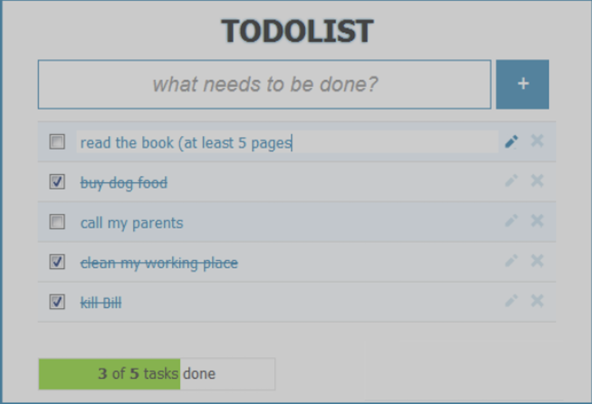

### TP : **Créer une Todo List en JavaScript pur**

### Contraintes

Vous devez rendre dans la partie devoir vos fichiers.
Vous devez proposer également un graphisme cohérent géré en CSS (voir la proposition ci-après).
Utilisez les notions que nous avons vu en cours.

#### Fonctionnalités :
Créer une application **Todo List** en utilisant uniquement **JavaScript**. L'application devra permettre :

- D'afficher la liste des tâches.
- D'ajouter de nouvelles tâches.
- De supprimer des tâches.
- D'éditer une tâche existante.
- De trier les tâches par date ou par statut.
- D'afficher un compteur du nombre de tâches par statut.

Toutes les données seront gérées directement dans le fichier `app.js`.

---

### Piste graphique 

### Partie 1 : **Initialisation du projet**

1. Créer un fichier `index.html` contenant la structure suivante :
2. Créer un fichier `app.js` pour gérer la logique JavaScript.
3. Créer un fichier `style.css` pour gérer les styles de l'application.

---

### Partie 2 : **Récupérer et afficher les tâches**

1. Stocker les tâches dans un tableau en JavaScript.
2. Chaque tâche doit contenir un **titre**, une **date** et un **statut**.
3. Insérer dynamiquement les tâches dans la liste (`ul`).
4. Chaque tâche doit avoir un bouton **Éditer** et **Supprimer** qui permet de la retirer du tableau et de mettre à jour l'affichage.
5. Afficher un compteur des tâches par statut.

---

### Partie 3 : **Ajouter une nouvelle tâche**

1. Récupérer les valeurs du formulaire (`title`, `date`, `status`).
2. Ajouter la tâche au tableau des tâches.
3. Mettre à jour la liste affichée.
4. Mettre à jour le compteur des tâches.

---

### Partie 4 : **Supprimer une tâche**

1. Associer un événement au bouton **Supprimer** de chaque tâche.
2. Retirer la tâche du tableau.
3. Mettre à jour l'affichage de la liste des tâches.
4. Mettre à jour le compteur des tâches.

---

### Partie 5 : Éditer une tâche

1. Associer un événement au bouton Éditer.
1. Permettre de modifier le titre, la date et le statut d'une tâche.
1. Sauvegarder les modifications dans le tableau des tâches.
1. Mettre à jour l'affichage de la liste.

### Partie 6 : Trier les tâches

1. Ajouter un bouton pour trier les tâches par date.
1. Ajouter un bouton pour trier les tâches par statut.
1. Implémenter la logique de tri et mettre à jour l'affichage.

### Partie 7 : **Test de l'application**

1. Vérifier que les tâches sont correctement ajoutées et affichées.
2. Tester l'ajout de nouvelles tâches et s'assurer qu'elles apparaissent bien dans la liste.
3. Tester la suppression des tâches et vérifier que la liste est bien mise à jour.

Bon courage à tous !