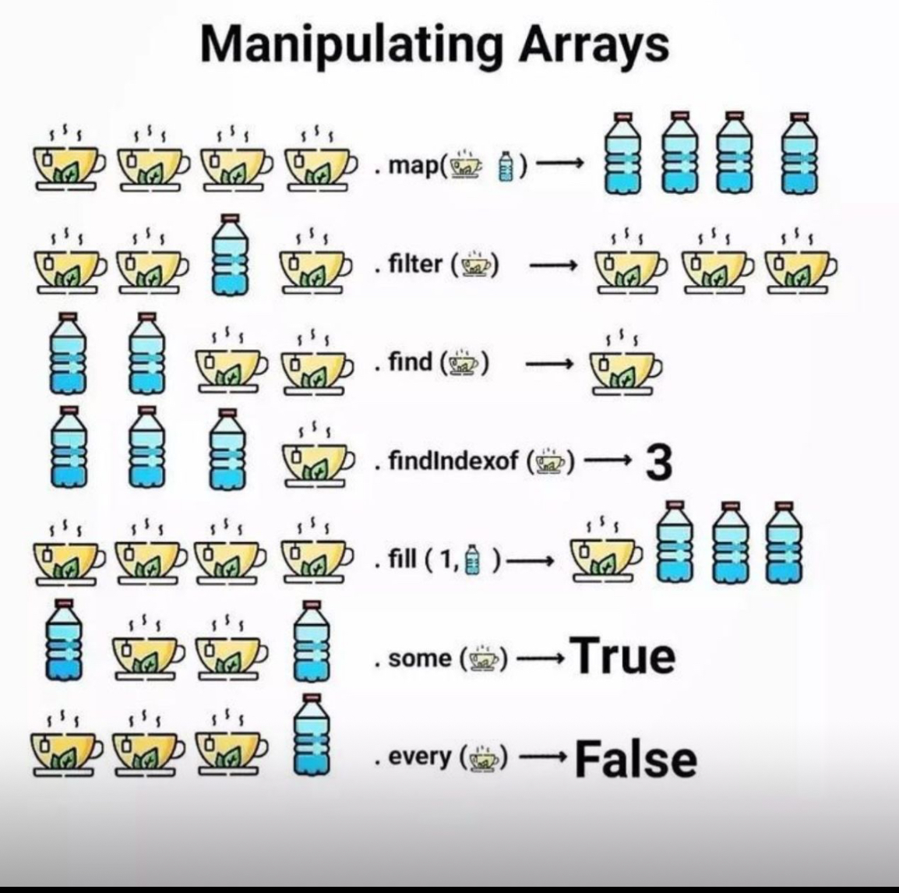

# Référence des tableaux

Les tableaux sont l'une des structures de données les plus couramment utilisées. Toutefois, une source fréquente de confusion, en particulier pour les personnes novices dans certains langages de programmation comme JavaScript, est la manière dont les tableaux sont référencés et assignés.

---

### Table des matières

- [Référence des tableaux](#référence-des-tableaux)
    - [Table des matières](#table-des-matières)
  - [1. **Référence vs Copie**](#1-référence-vs-copie)
  - [2. **Affectation par référence**](#2-affectation-par-référence)
  - [3. **Copier un tableau**](#3-copier-un-tableau)
  - [4. **Limitations de la copie superficielle**](#4-limitations-de-la-copie-superficielle)
  - [5. **Copie profonde**](#5-copie-profonde)
  - [6. **Method chaining**](#6-method-chaining)
  - [🟢 **7. La méthode `fill()`**](#-1-la-méthode-fill)
    - [🔹 **Syntaxe :**](#-syntaxe-)
    - [📌 **Exemple d'utilisation :**](#-exemple-dutilisation-)
  - [🟡 **8. La méthode `some()`**](#-2-la-méthode-some)
    - [🔹 **Syntaxe :**](#-syntaxe--1)
    - [📌 **Exemple d'utilisation :**](#-exemple-dutilisation--1)
  - [🔴 **9. La méthode `every()`**](#-3-la-méthode-every)
    - [🔹 **Syntaxe :**](#-syntaxe--2)
    - [📌 **Exemple d'utilisation :**](#-exemple-dutilisation--2)
  - [🔥 **Comparaison `some()` vs `every()`**](#-comparaison-some-vs-every)
    - [📌 **Exemple comparatif :**](#-exemple-comparatif-)
  - [✨ **Résumé et Cas d'Utilisation**](#-résumé-et-cas-dutilisation)


## 1. **Référence vs Copie**

Lorsque nous parlons de variables et d'objets en programmation, nous devons comprendre deux concepts essentiels :

- **Valeur primitive** : Une donnée simple, comme un nombre ou une chaîne de caractères.
- **Référence** : Une adresse mémoire où les données sont stockées.

Les tableaux, comme les objets, sont stockés en mémoire comme des références. Cela a d'importantes implications sur la manière dont ils sont manipulés.

---



## 2. **Affectation par référence**

Lorsque vous affectez un tableau à une nouvelle variable, vous ne créez pas une nouvelle copie de ce tableau. Vous créez simplement une nouvelle référence au tableau original.

```js
const array1 = [1, 2, 3];
const array2 = array1;

array2[0] = 99;

console.log(array1);  // [99, 2, 3]
console.log(array2);  // [99, 2, 3]
```

Dans cet exemple, en modifiant `array2`, nous avons également modifié `array1`, car les deux pointent vers la même référence en mémoire. Cela signifie que si vous modifiez un tableau, toutes les variables qui y font référence seront également affectées.

---

## 3. **Copier un tableau**

Si vous voulez éviter de modifier le tableau original en manipulant sa référence, vous devez créer une copie "superficielle" du tableau :

**Méthodes courantes pour copier un tableau en JavaScript** :

- **Spread Operator** :

  ```js
    const originalArray = [1, 2, 3, 4, 5];
    const newArray = [...originalArray];
  ```
  Nous reviendrons sur le **spread operator** dans un prochain chapitre.

- **Méthode slice()** :

  ```js
  const newArray = originalArray.slice();
  ```
  Ici, `slice()` sans arguments renvoie une copie du tableau entier. Si vous passez des arguments, par exemple `slice(1)`, cela renverra une copie du tableau à partir de l'index 1. Par exemple, `slice(1, 3)` renverra une copie du tableau de l'index 1 à l'index 3.
  ```js
    const originalArray = [1, 2, 3, 4, 5];
    const newArray = originalArray.slice(1, 3);
    console.log(originalArray);  // [1, 2, 3, 4, 5]
    console.log(newArray);  // [2, 3]
  ```

- **Méthode concat()** :

  ```js
  const newArray = [].concat(originalArray);
  ```

A savoir également, une chaîne de caractères peut être convertie en tableau avec la méthode `split()` :

```js
const str = "Hello";
const arr = str.split("");  // ["H", "e", "l", "l", "o"]
```

Et les chaînes de caractères peuvent également être traitées comme des tableaux, ce qui signifie que vous pouvez utiliser les méthodes `slice()`, `concat()` et `spread operator` sur les chaînes de caractères :

```js
const str = "Hello";
const newStr = str.slice(1);  // "ello"
```

Vous pouvez donc par exemple, utiliser un **spread operator** pour convertir une chaîne de caractères en tableau :

```js
const str = "Hello";
const arr = [...str];  // ["H", "e", "l", "l", "o"]
```

Et utiliser la méthode `join()` pour convertir un tableau en chaîne de caractères :

```js
const arr = ["H", "e", "l", "l", "o"];
const str = arr.join("");  // "Hello"
```

Bien que les chaînes de caractères et les tableaux soient similaires, ils ne sont pas identiques. Les chaînes de caractères sont des valeurs primitives, tandis que les tableaux sont des objets. Les tableaux ont des méthodes supplémentaires qui ne sont pas disponibles pour les chaînes de caractères, comme `push()` et `pop()`.

---

## 4. **Limitations de la copie superficielle**

Les méthodes mentionnées ci-dessus créent des copies superficielles. Si le tableau original contient des objets, ces objets ne seront pas dupliqués, mais seront référencés. Si l'un de ces objets est modifié dans le tableau copié, il sera également modifié dans le tableau original.

Par exemple :

```js
const originalArray = [{ name: "John" }];
const newArray = [...originalArray];

newArray[0].name = "Jane";

console.log(originalArray);  // [{ name: "Jane" }]
console.log(newArray);  // [{ name: "Jane" }]
```

Pour éviter cela, vous devez effectuer une "copie profonde" du tableau, ce qui signifie que vous devez également dupliquer les objets internes.

Par exemple comme ceci:
  
```js
const originalArray = [{ name: "John" }];
const newArray = JSON.parse(JSON.stringify(originalArray));

newArray[0].name = "Jane";

console.log(originalArray);  // [{ name: "John" }]
console.log(newArray);  // [{ name: "Jane" }]
```

---

## 5. **Copie profonde**

Si un tableau contient des objets ou d'autres tableaux et que vous voulez créer une copie entièrement indépendante (où même les objets internes sont dupliqués), vous devez effectuer une "copie profonde". Des bibliothèques comme Lodash offrent des fonctions pour cela (`_.cloneDeep()`), ou vous pouvez utiliser des méthodes spécifiques selon le langage de programmation.

---

## 6. **Method chaining**

Il est possible d'enchaîner plusieurs méthodes sur un tableau. Cela signifie que vous pouvez appeler une méthode sur le tableau, puis appeler une autre méthode sur le résultat de la première méthode, et ainsi de suite.

Par exemple :

```js
const arr = [1, 2, 3];

const result = arr
  .map(x => x * 2)
  .filter(x => x > 2)
  .reduce((acc, x) => acc + x, 0);

console.log(result);  // 10
```

Bien entendu, vous pouvez également enchaîner des méthodes même sur une chaîne de caractères, ou sur tout autre objet.

```js
const str = "Hello";

const result = str
  .split("")
  .reverse()
  .join("");

console.log(result);  // "olleH"
```


- **`fill()`** : Remplit un tableau avec une valeur spécifique.
- **`some()`** : Vérifie si **au moins un élément** d'un tableau satisfait une condition.
- **`every()`** : Vérifie si **tous les éléments** d'un tableau satisfont une condition.

Nous allons voir comment elles fonctionnent avec des exemples pratiques. 🚀

---

## 🟢 **7. La méthode `fill()`**
La méthode `fill()` modifie un tableau existant en remplissant tous (ou une partie) de ses éléments avec une valeur donnée.

### 🔹 **Syntaxe :**
```js
array.fill(value, start, end);
```
- **`value`** : La valeur à insérer.
- **`start`** *(optionnel)* : L'index de début (inclus).
- **`end`** *(optionnel)* : L'index de fin (exclus).

### 📌 **Exemple d'utilisation :**
```js
let arr = [1, 2, 3, 4, 5];

// Remplit tout le tableau avec 0
arr.fill(0);
console.log(arr); // [0, 0, 0, 0, 0]

// Remplit les éléments d'index 1 à 3 avec 9
arr.fill(9, 1, 4);
console.log(arr); // [0, 9, 9, 9, 0]
```

📝 **Remarque :**  
- Si **`start`** et **`end`** ne sont pas précisés, tous les éléments seront remplacés.
- `fill()` **modifie directement** le tableau original.

---

## 🟡 **8. La méthode `some()`**
`some()` permet de tester si **au moins un élément** d'un tableau satisfait une condition. Elle retourne un **booléen** (`true` ou `false`).

### 🔹 **Syntaxe :**
```js
array.some(callback);
```
- **`callback`** : Une fonction qui prend chaque élément et retourne `true` si la condition est remplie.

### 📌 **Exemple d'utilisation :**
```js
let numbers = [3, 7, 9, 2, 6];

// Vérifie si au moins un nombre est pair
let hasEven = numbers.some(num => num % 2 === 0);
console.log(hasEven); // true (car 2 et 6 sont pairs)

// Vérifie si au moins un nombre est supérieur à 10
let hasBigNumber = numbers.some(num => num > 10);
console.log(hasBigNumber); // false
```

📝 **Remarque :**  
- `some()` **s'arrête dès qu'il trouve un élément qui satisfait la condition**.
- Si aucun élément ne répond à la condition, `some()` retourne `false`.

---

## 🔴 **9. La méthode `every()`**
`every()` permet de tester si **tous** les éléments du tableau respectent une condition. Elle retourne un **booléen**.

### 🔹 **Syntaxe :**
```js
array.every(callback);
```
- **`callback`** : Une fonction qui teste chaque élément et retourne `true` ou `false`.

### 📌 **Exemple d'utilisation :**
```js
let ages = [18, 22, 30, 25];

// Vérifie si tous les âges sont supérieurs ou égaux à 18
let allAdults = ages.every(age => age >= 18);
console.log(allAdults); // true

// Vérifie si tous les âges sont inférieurs à 30
let allYoung = ages.every(age => age < 30);
console.log(allYoung); // false (car 30 n'est pas < 30)
```

📝 **Remarque :**  
- `every()` **s'arrête dès qu'il trouve un élément qui ne respecte pas la condition**.
- Si tous les éléments respectent la condition, `every()` retourne `true`, sinon `false`.

---

## 🔥 **Comparaison `some()` vs `every()`**
| Méthode  | Vérifie si…  | Retourne `true` si… |
|----------|-------------|--------------------|
| `some()` | Au moins un élément respecte la condition | Un élément au moins valide la condition |
| `every()` | Tous les éléments respectent la condition | Tous les éléments valident la condition |

### 📌 **Exemple comparatif :**
```js
let values = [10, 20, 30, 40];

// `some()`: Vérifie s'il y a un nombre > 35
console.log(values.some(num => num > 35)); // true (car 40 est > 35)

// `every()`: Vérifie si tous les nombres sont > 5
console.log(values.every(num => num > 5)); // true (tous sont > 5)
```

---

## ✨ **Résumé et Cas d'Utilisation**
| Méthode  | Utilisation typique |
|----------|--------------------|
| `fill()` | Remplir un tableau avec une valeur donnée |
| `some()` | Vérifier si **au moins un élément** respecte une condition |
| `every()` | Vérifier si **tous les éléments** respectent une condition |

🎯 **Exemples d'applications :**
- **`fill()`** : Réinitialiser un tableau (`arr.fill(0)`)
- **`some()`** : Vérifier si une liste contient un élément spécifique (`arr.some(el => el === 'admin')`)
- **`every()`** : Vérifier si tous les éléments respectent une règle (`arr.every(num => num > 0)`)
