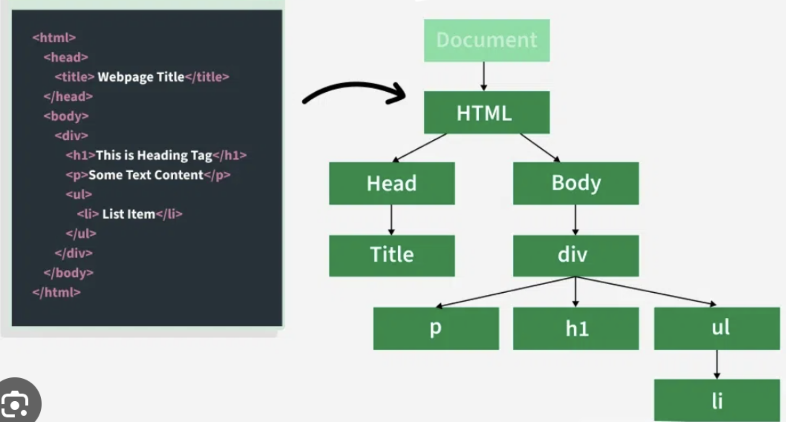

# **Cours sur le DOM en JavaScript**

Nous utiliserons largement la documentation de `developer.mozilla.org`

JavaScript a été créé en 1995 par Brendan Eich chez Netscape sous le nom de Mocha, puis renommé en LiveScript, avant d'adopter son nom actuel. Depuis, il a évolué avec de nombreuses versions marquantes.

- 1995	JavaScript 1.0	Création du langage chez Netscape.
- 1997	ECMAScript 1 (ES1)	Standardisation sous ECMA-262.
- 2009	ECMAScript 5 (ES5)	Mode strict, JSON natif, nouvelles méthodes sur Array/Object.
- 2015	ECMAScript 6 (ES6)	Introduction de let/const, des classes, des promesses, des modules (import/export), et du arrow function (=>).
- 2016-2024	ES7+	Ajout d'async/await, Object.entries(), Optional Chaining (?.), Nullish Coalescing (??), et bien d'autres améliorations.

On le trouve dans le développement Frontend et Backend.

💡 Aujourd'hui, JavaScript est un langage incontournable du développement web, et son écosystème continue d'évoluer chaque année !

Le site **[developer.mozilla.org](https://developer.mozilla.org/fr/)** (MDN) est une ressource en ligne de référence pour les développeurs web. Il est géré par **Mozilla**, l'organisation derrière le navigateur Firefox. Ce site est l'une des meilleures sources d'information pour tout ce qui concerne le développement web, incluant des langages comme **HTML**, **CSS**, **JavaScript**, ainsi que des technologies plus avancées comme **Web APIs**, **WebAssembly**, et bien plus.

---

# **Introduction à la manipulation du DOM en JavaScript**  

Le **DOM (Document Object Model)** représente la structure d'une page HTML sous forme d'un arbre d'éléments. Grâce à JavaScript, il est possible d’accéder, de modifier et d’interagir dynamiquement avec ces éléments via l’objet `document`.  



## **Sélectionner un élément dans la page**  

JavaScript propose plusieurs méthodes pour cibler un élément spécifique :  

```js
document.body; // Accède à l'élément <body> du document
document.getElementById('root'); // Récupère l'élément qui a l'ID "root"
document.querySelector('.main'); // Sélectionne le premier élément correspondant au sélecteur CSS

// récupère en retirant les espace le contenu du div#root
document.getElementById('root').innerHTML.trim()

// récupère le premier élément (html) trouver dans la liste ul.li 
document.querySelector('ul>li').innerHTML

document.querySelector('.main').innerText.toUpperCase()
```

## **Sélectionner plusieurs éléments**  

Si vous souhaitez récupérer plusieurs éléments en une seule fois :  

```js
const elements = document.querySelectorAll('.content'); // Sélectionne tous les éléments avec la classe "exemple"

// Parcourir la liste des éléments sélectionnés
elements.forEach(item => {
    console.log(item); // Affiche chaque élément dans la console
});

// Convertir la liste en un tableau standard
const elementsArray = Array.from(elements);
```

Remarque: si vous avez une somme de valeurs à faire dans le DOM, une fois récupéré les valeurs avec les fonctions du DOM, pensez à `caster` ces valeurs en `parseFloat` ou `parseInt` pour faire des calculs numérique.

### Exercice

1. Affichez les valeurs numérique dans le `ul.li`
2. Faites la somme des valeurs numériques.
   
```html
<!DOCTYPE html>
<html lang="en">
<head>
    <meta charset="UTF-8">
    <meta name="viewport" content="width=device-width, initial-scale=1.0">
    <title>Page Web</title>
</head>
<body>
    <div id="root">
        <ul>
            <li>100</li>
            <li>250</li>
            <li>500</li>
        </ul>
    </div>
    <script>
        //console.log(document)
        // 1. affichez les valeurs
        // dans querySelector ou querySelectorAll utilisez les classes ou les selecteurs CSS
        const els = document.querySelectorAll('ul>li')
    </script>
</body>
</html>
```

## Exercice afficher et mettre en majuscule

Dans un autre fichier `exercice-afficher.html`

1. Affichez le texte dans la console (navigateur `console.log`).
2. Mettre ce texte dans la console en majuscule (`toUpperCase`).
3. Essayez de l'afficher dans la page ( utilisez la méthode `innerHTML`).

```html
<!DOCTYPE html>
<html lang="en">
<head>
    <meta charset="UTF-8">
    <meta name="viewport" content="width=device-width, initial-scale=1.0">
    <title>Page Web</title>
</head>
<body>
    <div id="root">
        <h1 class="titre">hello world</h1>
    </div>
    <script>
     
    </script>
</body>
</html>
```

## **Obtenir des informations sur un élément**  

Une fois un élément sélectionné, voici quelques méthodes pour récupérer ses informations :  

```js
element.getAttribute('src'); // Récupère la valeur d’un attribut
element.style; // Accède aux styles appliqués à l'élément
element.classList; // Liste les classes CSS attribuées à l'élément
element.innerHTML; // Récupère le code HTML interne
element.innerText; // Renvoie le texte affiché visuellement
element.textContent; // Retourne tout le texte contenu, même caché
```

## **Modifier un élément**  

Il est possible d'altérer le contenu, les styles ou les attributs d’un élément :  

```js
element.setAttribute('alt', 'Nouvelle description'); // Change la valeur d’un attribut
element.style.color = 'blue'; // Modifie la couleur du texte
element.classList.add('nouvelle-classe'); // Ajoute une classe CSS
element.innerHTML = '<strong>Texte modifié</strong>'; // Modifie le contenu HTML
element.innerText = 'Nouveau texte'; // Change uniquement le texte visible
```

## **Se déplacer dans l’arborescence du DOM**  

Le DOM étant une hiérarchie d’éléments imbriqués, on peut naviguer entre eux :  

```js
element.childNodes; // Récupère tous les enfants, y compris les espaces et textes
element.children; // Récupère uniquement les éléments enfants
element.firstChild; // Renvoie le premier nœud enfant (peut être un texte)
element.firstElementChild; // Récupère le premier élément enfant
element.previousElementSibling; // Récupère l’élément précédent
element.nextElementSibling; // Récupère l’élément suivant
```

## **Modifier la structure de la page**  

JavaScript permet d’ajouter ou de supprimer dynamiquement des éléments :  

```js
element.appendChild(nouveauElement); // Ajoute un élément en tant qu'enfant
element.append(nouveauElement); // Insère un élément (HTML ou texte)
element.remove(); // Supprime l’élément du DOM
parent.insertBefore(nouveauElement, referenceElement); // Ajoute un élément avant un autre
parent.insertAdjacentHTML('beforebegin', '<p>Texte avant</p>'); // Insère du HTML à une position spécifique
```

## Exercice

Créez une page HTML avec un `div.main` et ajoutez un paragraphe avec du texte en rose (définissez ce style avec du JavaScript).

---

### **Conclusion**  

Le DOM offre de nombreuses possibilités pour interagir avec une page web. Ces méthodes ne sont qu'un aperçu des manipulations possibles. Pour plus d'informations, consultez la documentation officielle sur [MDN Web Docs](https://developer.mozilla.org/fr/docs/Web/API/Document_Object_Model).
